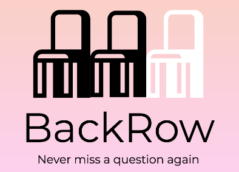

# BackRow
# 
## Description
BackRow is a Question and Answer web app which is meant to make your Google Slides presentations go along smoothly. Made with introverts in mind, never miss the opportunity to ask a question about the context of the presentation by simply submitting your question or comment to the presentation’s question log. At the end of the presentation, the presenter can simply pull up the question log and go through the audience’s submitted questions one by one. Never miss a question again with BackRow!
## Getting Started
These instructions will give you a copy of BackRow up and running on your local machine for development and testing purposes
### Prerequisites
For this project to work on your machine, you will need to download and install all the dependencies listed in the `requirements.txt` folder. To do so, fork this repo on your machine and create a directory where you can `git clone` it. From there, run the following command to install the dependencies.

``` 
pip instsall -r requirements.txt 
```

If you want to create a virtual environment before hand, run 

``` 
pip install virtualenv
virtualenv [name_of_the_env_you_are_creating]
```

To activate the virtualenv that you have just created, use

```
source [name_of_the_env_you_are_creating]/bin/activate
```

To deactivate your virtualenv, run

```
deactivate
````
## Deployment
Deployed using
* [Nginx](https://www.nginx.com/) - Web server used for deployment

## Built With
* [Django](https://www.djangoproject.com/) - The framework used for this project
* [Google Drive API](https://developers.google.com/drive/) - API used for getting user's Google Slides
* [OAuth2](https://oauth.net/2/) - Used to authenticate users
* [Bootstrap](https://getbootstrap.com/) - Used for frontend

## Authors
* Jenn Ogden
* Nicole Swanson
* Jinji Zhang

## Acknowledgments
